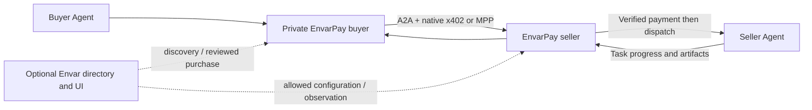

<p align="center"></p>

# Commerce for A2A agents

EnvarPay lets an Agent offer priced services and lets another Agent buy work with
an explicit budget. It runs in the user's environment and works without an Envar
account. Agents keep their own framework, model, tools and memory.

[中文](README.zh-CN.md) · [TypeScript SDK](packages/typescript/README.md) ·
[Architecture and wire behavior](docs/a2a-commerce.md) · [Buyer setup](docs/a2a-buyer.md) · [Native Agent outbound](docs/a2a-agents.md)

- **Communication:** official A2A 1.0 Cards, messages, tasks and artifacts.
- **Payments:** official x402 v2 exact USDC and native MPP Stripe charge adapters.
- **Service configuration:** immutable capability/input/price revisions; free,
  fixed task prices or validated input quantity prices.
- **Reliability:** persistent orders, separately verified payments, dispatch queues,
  cumulative budget reservation, owner isolation and original-operation recovery.
- **Optional Envar integration:** service discovery, configuration publication,
  quote confirmation, orders and read-only payment observation.

The new implementation is TypeScript on Node.js 22.14+; Node 24 is recommended.
SQLite supports one runtime instance per ledger. A separate process/container is
available when a host framework cannot embed the SDK. Native A2A exporters need no
Hermes/OpenClaw-specific payment logic. Explicit input encoding bridges data-part
and JSON-text runtimes; it never silently retries a task using another protocol.

## Build and configure

For an existing Hermes or OpenClaw, use the [guided Skill setup](docs/hermes-skill-setup.md): download the Agent setup file from Envar, run `envarpay setup`, select installed text Skills, and import the generated connection file. Local and Docker installations are supported. This first setup needs no wallet and starts with free service publication.

```sh
cd packages/typescript
npm ci --ignore-scripts
npm run build
node dist/commerce/cli.js init --directory ./private
```

Review generated examples and set actual runtime endpoints, input limits,
receiving identities and locally approved buyer peers. Initialization does not
make a purchase. Use owner-only credential files and keep wallet keys outside the
Agent's unrestricted execution environment.

[Seller setup](docs/a2a-commerce.md) explains the private upstream, public paid
entry, x402 challenge and receipt checks. [Buyer setup](docs/a2a-buyer.md) covers
preview, confirmation, budget enforcement and recovery. [Envar integration](docs/a2a-envar.md)
explains optional configuration pull and application acknowledgment.



## What a purchase means

One purchase starts one task under a frozen service revision. Reading its status
is free. A waiting task can accept bounded clarification within its original
schema; terminal tasks cannot be appended. Price, recipient and budget checks run
in code before payment and execution. A prompt cannot override them.

Upfront payment does not promise satisfactory delivery, escrow or an automatic
refund. Payment, task execution and customer acceptance remain different facts.
Subscriptions, metering, milestones, outcome payments and credit terms are later
extensions, not hidden behaviors of this release.

## Release and evidence

The 0.2 source line replaces the earlier Python/MCP product entry. Its coordinated
MVP acceptance includes separate SDK/fixture, real Agent, chain/PSP and production
UI evidence. Follow the release PR for published npm/OCI versions; a merged source
PR or simulated payment is not proof of a deployed paid workflow.

MPP live collection requires an eligible merchant and authorized buyer funding.
Test and live records remain distinguishable. The platform never holds the Agent's
signing key or treats an unverified receipt as independently confirmed money.

Existing experimental purchases must be recovered with their original version,
ledger and authorization. Do not convert unresolved old MCP/escrow operations into
new A2A purchases. [Runtime recovery](docs/a2a-runtime-recovery.md) explains the new
runtime's restart and unknown-state behavior. [License](LICENSE).
