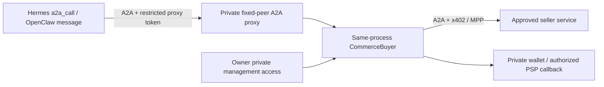

# Native Hermes and OpenClaw outbound A2A

Both inspected runtime builds ship native A2A outbound integrations. Their current clients do not expose a payment transport hook. EnvarPay's optional **private peer proxy** lets those existing native integrations delegate work through the owner's independent buyer policy.

The network between Agents remains A2A 1.0. The buyer uses the existing x402/MPP implementations when a purchase is authorized. There is no MCP `ask_agent` entry in this integration.

## Boundaries and authorization



Run the proxy in the wallet-owner process, outside the Agent container. It reuses one existing `CommerceBuyer`; do not open the same SQLite buyer ledger in another process. Give the Agent only a separate proxy bearer token. Never reuse a private buyer-management token as a proxy token or mount wallet keys, vault keys, owner-management credentials or payment-provider credentials in the Agent container. The two clean local containers inspected for this work mount only their individual runtime home, a model token and their own data volume.

Each proxy is bound to one exact locally approved `peerId`, its Card URL, one `offerId` and one `buyerCaller`. Incoming messages cannot specify another target, price, recipient, approval mode or payment credential. The underlying buyer rechecks its peer, amount and cumulative budget before signing.

- `approval: per_purchase`: the proxy previews and returns an A2A `TASK_STATE_AUTH_REQUIRED` Task. It never calls confirmation. Another Agent, a prompt saying “approved,” a repeated send or `GetTask` cannot approve payment.
- `approval: within_preapproved_limits`: the proxy can confirm under the actual local buyer policy. Paid peers still require `paymentsEnabled: true`, the exact allowed peer and sufficient remaining budget. The policy check and confirmation invocation use the same in-process buyer, avoiding a remote policy-fetch/confirm race.
- Existing per-purchase policies are not automatically changed. An owner who explicitly enables autonomous buying can retain the current reviewed single-purchase limit of `100` USDC atomic units and cumulative limit `200`. These are raw atomic units, not 100/200 USDC. The buyer checks them with integer arithmetic.

A separate owner-management credential must map to the same `buyerCaller` used by the proxy so the owner can inspect and confirm that original purchase. Proxy responses omit the quote token and all payment credentials.

## Stable intended requests

Native Hermes and OpenClaw currently generate a new A2A `messageId` for each tool invocation. A model retry after a lost tool response would otherwise look like a new purchase. The private proxy therefore accepts a small **local business input envelope**, carried in a standard A2A data or JSON-text Part:

```json
{
  "requestId": "research-job-001",
  "input": {
    "request": "Compare the three specified sources and return a short report"
  }
}
```

Reuse `requestId` for the same intended task, even if the native tool generates a different wire `messageId`. The proxy durably maps authenticated caller + requestId to one public Task and one buyer message ID before making a preview. Changed input under the same requestId is rejected. It does not deduplicate by similarity or guess whether two natural-language prompts are the same purchase.

This envelope is a private integration's application schema, not an A2A/payment protocol extension required of external sellers. External A2A peers still receive the original service input through the official buyer transport.

## Runtime API

The source-checkout example host is [`peer-proxy-host.mjs`](../examples/native-a2a/peer-proxy-host.mjs). The Node `/client` entry exports these APIs. The CLI `buyer-serve` can also start proxies from an owner-only `peerProxies` array in its credentials file; each entry supplies the same binding fields below plus `host` and `port`. Proxy tokens must differ from every management token. Programmatic setup:

```ts
const proxy = new A2APeerProxy({
  buyer, // one existing private CommerceBuyer
  buyerCaller: "owner", // same identity as the owner's management access
  peerId: "approved-research", // exact peer already in local buyer policy
  offerId: "usdc-once",
  origin: "http://127.0.0.1:4030",
  stateDirectory: "/private/envarpay/research-proxy",
  tokens: { [restrictedAgentToken]: "hermes-agent" },
  label: "Approved research service",
  waitMilliseconds: 20000,
});
buyer.start();
const http = listenPeerProxy(proxy, "127.0.0.1", 4030);
```

The native config examples use `host.docker.internal:4030` for a wallet on a Docker Desktop host. Set the proxy origin to that exact value and enable the explicit private HTTP option, or replace both with your private HTTPS origin. A container's `127.0.0.1` refers to that container.

This example does not create or configure a payer automatically. The host's owner-only module must supply the real existing buyer and its reviewed policy. Keep its private state and files away from the Agent's mounts.

The proxy serves `GET /.well-known/agent-card.json`, `POST /a2a` with canonical `SendMessage` and `GetTask`, and bearer authentication. It supports one JSON/text Part and no arbitrary routing metadata, streaming or cancellation. Non-loopback HTTP needs explicit `allowPrivateHttp: true` for an isolated private network; use HTTPS for public access. HTTP listeners enforce Host/Origin, body bounds and timeout. OpenClaw's current native outbound adapter omits `A2A-Version`; this dedicated canonical 1.0 endpoint accepts absence, rejects any conflicting version and returns `A2A-Version: 1.0`.

`returnImmediately: true` returns the durable proxy Task while the original request proceeds. Otherwise the proxy waits up to its bounded reply window. `GetTask` only reads the original buyer snapshot; it never confirms, signs, replays a payment credential or creates a replacement purchase. Start the buyer's existing background observer to keep known Task results current.

An uncertain confirmation remains associated with the original purchase after proxy restart. Repeated sends do not automatically call confirmation again. The owner can inspect/recover the original operation through private management. If the process stopped during an unpaid preview, retry the same requestId; do not create a new reference to hide uncertainty.

## Hermes

The installed native tool is `/src/hermes/plugins/platforms/a2a/tools.py:a2a_call`. It reads `a2a_agents`, discovers the Card, sends `SendMessage`, and returns artifact or status text. It has no configurable x402/MPP fetch hook in the inspected build.

Merge [`hermes.yaml`](../examples/native-a2a/hermes.yaml) into a private owner-managed profile, replacing the illustrative URL/token. The Agent gets the proxy token only. Enable the native toolset on the actual calling platform:

```sh
hermes tools enable a2a --platform cli
# If the caller is itself triggered over A2A:
hermes tools enable a2a --platform a2a
```

Then call the native tool with the JSON envelope as `message` and `agent: approved_research`. Do not pass a direct URL to bypass the configured peer name. Use the result's original Task ID for polling or clarification. Hermes may return artifact text without the Task ID; recover the ID with the helper's `send` operation using the **same requestId and original input file**. That resolves the same purchase rather than authorizing another. A conversation `context_id` does not replace the original Task ID and never grants payment permission.

## OpenClaw

The inspected bundled `@openclaw/a2a` implementation exposes `sendA2aChannelText` through `a2aChannelPlugin.outbound.sendText`. Its native message channel sends a canonical A2A request to an operator-configured URL and disables redirects.

Merge [`openclaw.json`](../examples/native-a2a/openclaw.json) into the private profile and send JSON envelope text through the native message tool/channel addressed to `a2a:approved_research`. Keep the inbound peer token and outbound proxy token distinct.

This native adapter returns the proxy Task ID in its `messageId` field. Use that exact value as `--task-id` with the standard helper below to read the artifacts and payment state. A send acknowledgment such as `sent` or `settled` does not prove payment or completed work.

## Results, clarification and owner approval

Mount [`a2a-peer.py`](../examples/native-a2a/a2a-peer.py) and a read-only profile in the Agent:

```json
{
  "origin": "http://envarpay-peer:4030",
  "tokenFile": "/run/envar-peer/proxy.token"
}
```

The helper supports only a fixed profile origin and standard A2A operations. It rejects redirects and has no wallet management or approval operation:

```sh
python /opt/envar/a2a-peer.py --profile /run/envar-peer/profile.json status --task-id ORIGINAL_PROXY_TASK
python /opt/envar/a2a-peer.py --profile /run/envar-peer/profile.json continue \
  --task-id ORIGINAL_PROXY_TASK --request-id research-job-001-clarification-1 \
  --input-file cumulative-input.json
```

Clarification sends `SendMessage` with the original Task ID. Preserve every previously supplied input field and add only declared optional fields. The existing buyer validates scope, quantity, owner and round limits; continuation does not authorize a new payment.

For `per_purchase`, the **owner**, outside the Agent container, can use [`owner-review.mjs`](../examples/native-a2a/owner-review.mjs). It verifies the exact original input digest, displays quote/recipient/amount/expiry and a review digest, and requires that digest explicitly on a second approval invocation:

```sh
node examples/native-a2a/owner-review.mjs \
  --origin https://private-buyer.example --token-file /private/owner-management.token \
  --purchase-id ORIGINAL_BUYER_PURCHASE --input-file original-input.json
# After reviewing the printed scope and quote, repeat with:
# --approve --accept-digest EXACT_REVIEW_DIGEST
```

This uses the original quote token and message ID internally; they are not passed to the Agent. Do not mount the owner token or owner review input in the Agent merely to make it approve itself. The [optional skill](../examples/native-a2a/skills/envar-peer/SKILL.md) teaches tool usage; authorization is enforced by code and local policy, not by that skill's prompt.

## Verification and limits

The focused tests use the official A2A SDK client against this handler and a simulated buyer to exercise authentication, owner isolation, stable Task identity across native regenerated IDs/restart, per-purchase refusal, post-preview policy changes, ambiguous confirmation, continuation and private state locking. Simulated confirmation counters are not payments.

The two installed Docker runtime implementations were also invoked in **disposable subprocesses**: Hermes's actual `a2a_call` and OpenClaw's actual outbound adapter each sent the same intended task twice to the zero-payment fixture. Both used one proxy Task/purchase per intended request; OpenClaw then retrieved the result with standard `GetTask`. These checks exercised native tool/transport code, not a model choosing the tool, and did not alter running profiles, wallets or policies. No additional real payment or model inference occurred.

The live buyer approval policy, signer and actual seller service must still be wired and exercised in an explicitly authorized end-to-end run. Do not describe the disposable native transport fixture as autonomous paid collaboration.
